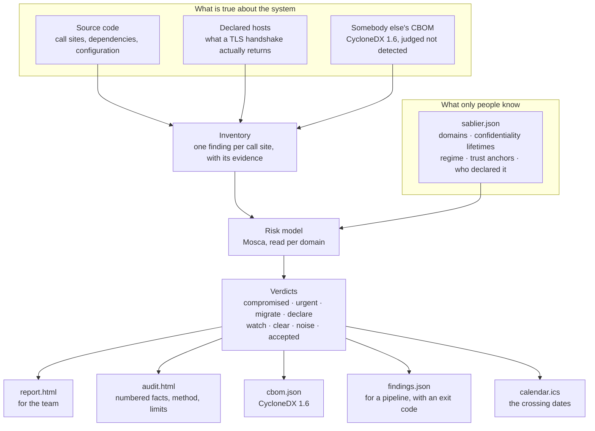
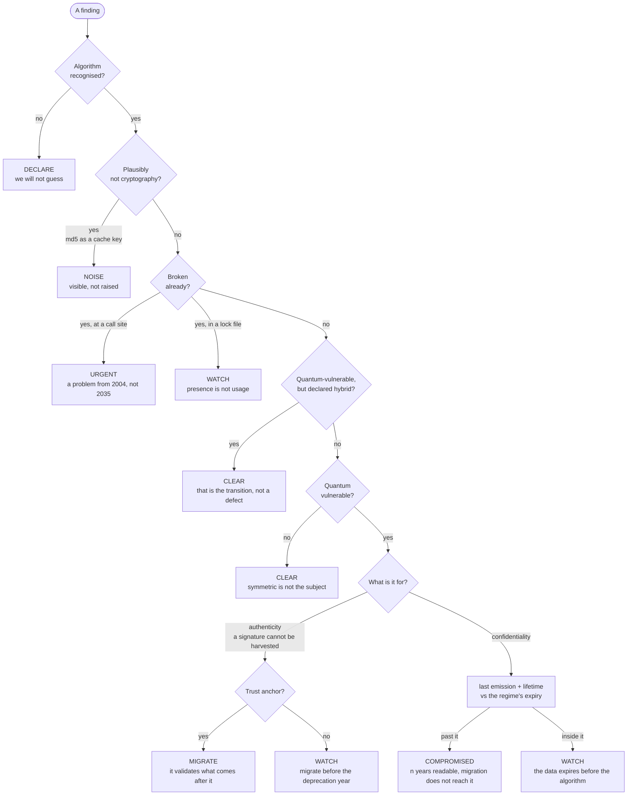
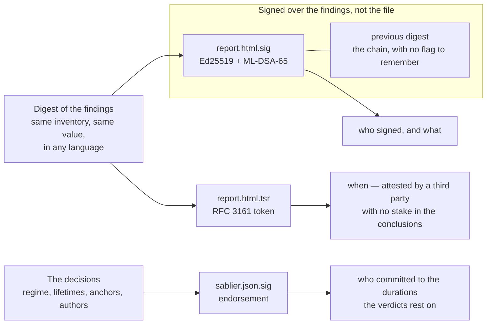

# How Sablier works

One page, three diagrams. The long version is the [README](../README.md); this is
the shape of the thing.

## The pipeline

Two sources of fact, one input no scanner can find on its own, and one risk model
that turns the three into verdicts.

The first group is measured. The second is declared, and it is the half every
other tool leaves out: *how long does this data have to stay confidential?*
Without it an inventory is a list of algorithms, and a list of algorithms has no
deadline in it.

## The one question, decided

The arithmetic is Mosca's inequality, simplified to the only form that fits on a
line: **a secret written in year `E` and required to stay secret for `L` years is
readable if `E + L` lands past the year the algorithm stops holding.** The
crossing year — when a system starts producing data it cannot protect — is
`expiry − lifetime + 1`.

Two rules keep this honest. An **accepted** finding changes section, never
disappears: the original verdict stays attached, the reason is printed, and the
acceptance expires on a date the reader can see. And a declared dependency with a
published high-severity advisory becomes `URGENT` — the only place where
"presence is not usage" gives way, because an advisory says somebody already found
a way in while the rest of this document argues about 2035.

Under the `eu` regime the expiry is not one date for the project: it is read off
each domain. A confidentiality lifetime of ten years or more, or a trust anchor,
is high risk and due 2030; everything else is medium and due 2035.

## The four artefacts, and what each one proves

A report that cannot be checked is an opinion. Four files, each answering a
different question, and none of them answering a question that belongs to
another.

- **The signature covers a digest of the findings, never the rendered page.** Two
  runs of one inventory differ byte for byte and say the same thing; two
  renderings in two languages give the same digest. Which also means a published
  page altered by hand still verifies — so the document prints that limit, and the
  way to close it is to replay the analysis on the same source and compare.
- **The chain is automatic.** A second run over the same output path records the
  digest it is replacing inside what it signs. A folder of reports is an audit
  trail; a missing link shows.
- **The date comes from somebody else.** `signed_at` is covered by the signature
  and still worthless as evidence: it is read off the clock that signed. An
  RFC 3161 token answers *when*, and `openssl ts -verify -digest <the digest
  printed in the report>` checks it with no reference to this tool.
- **The input is signed too.** Every verdict rests on durations that were a string
  somebody typed. The endorsement signs the decisions — not the bytes, so
  reformatting the file does not break it.

Each of those limits is printed in the document itself. That is the part of this
design that took the longest, and the only part that matters: a seal a reader
cannot use, or can over-read, is worse than no seal.
